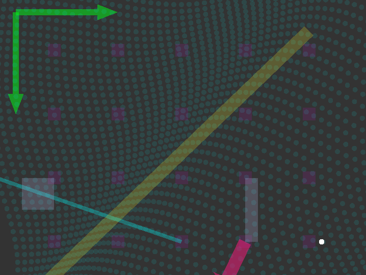

## Overview

A library that lets you draw various simple 2d geometry primitives fast using a single
shader program and a single vertex buffer object with a safe api (provided no other libray
is calling opengl functions).

## Screenshot

